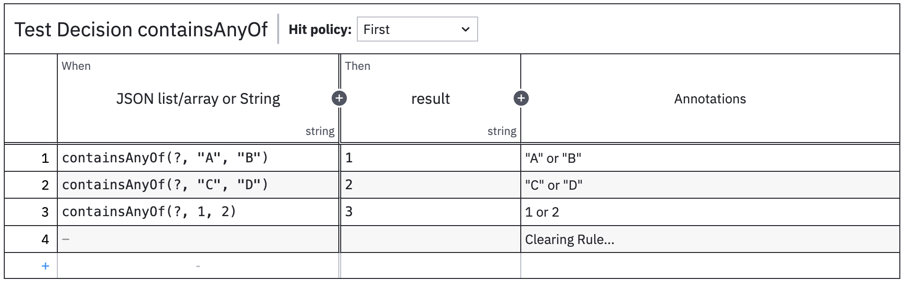

# DMN Custom Functions
Camunda extension to provide the set of additional FEEL functions for DMN.

## Why
* Sometimes standard FEEL functions are not enough, therefore we need a way to define our own...

## Functions (to be extended...)
* `containsAnyOf`
```java
/**
* Format: containsAnyOf(input, entries...)
* Supports as Input:
* - json-array(list) String or Long/Integer as Element
* - String - works as String.contains (substring)
* entries... - comma separated
*/
```
Example: 

## Test Reports

### Deployment Test:
```
Test Class: org.camunda.bpm.examples.custom.dmn.process.DeploymentTest

 Ensure deployment

   Given a decision engine
    Then 1 deployed DMN decision definition(s)
         DMN decision definition of type 'Test_Decision_ContainsAnyOf'
```

### DMN Test:
```
Test Class: org.camunda.bpm.examples.custom.dmn.process.CustomFunctionTest

 Contains any of

   Given a decision engine
         a decision input
         with 'input' = <input>
    When evaluate decision 'Test_Decision_ContainsAnyOf'
    Then decision result
         has 1 decision(s)
         with rule = <ruleId>
         with 'result' = <output>

  Cases:

   |  # | input         | ruleId                  | output | Status  |
   +----+---------------+-------------------------+--------+---------+
   |  1 | '["A","B"]'   | 'DecisionRule_1'        | '1'    | Success |
   |  2 | '["A","B"]'   | 'DecisionRule_1'        | '1'    | Success |
   |  3 | '["B","C"]'   | 'DecisionRule_1'        | '1'    | Success |
   |  4 | '["C","D"]'   | 'DecisionRule_2'        | '2'    | Success |
   |  5 | '["D","E"]'   | 'DecisionRule_2'        | '2'    | Success |
   |  6 | '[1,2,3,4,5]' | 'DecisionRule_3'        | '3'    | Success |
   |  7 | 'ABC'         | 'DecisionRule_1'        | '1'    | Success |
   |  8 | 'CDE'         | 'DecisionRule_2'        | '2'    | Success |
   |  9 | '["AB","BC"]' | 'DecisionRule_Clearing' | 'null' | Success |
   | 10 | '["ab","bc"]' | 'DecisionRule_Clearing' | 'null' | Success |
   | 11 | '["Ab","bC"]' | 'DecisionRule_Clearing' | 'null' | Success |
   | 12 | '["E","F"]'   | 'DecisionRule_Clearing' | 'null' | Success |
   | 13 | '[3,4,5]'     | 'DecisionRule_Clearing' | 'null' | Success |
   | 14 | 'EF'          | 'DecisionRule_Clearing' | 'null' | Success |
```

