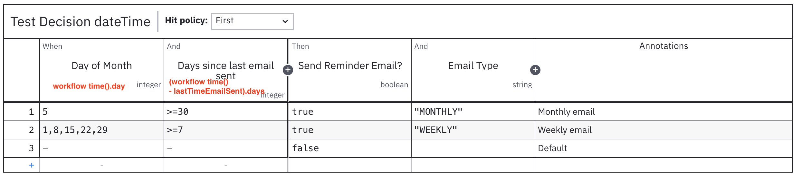
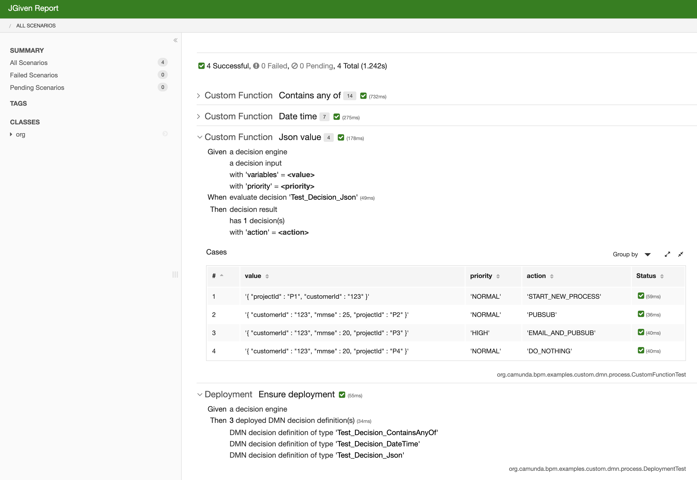

# DMN Custom Functions
Camunda extension to provide the set of additional FEEL functions for DMN.

## Why
* Sometimes standard FEEL functions are not enough, therefore we need a way to define our own...

## Functions (to be extended...)
* `containsAnyOf`
```java
// Format: containsAnyOf(input, entries...)
// Supports as Input:
// - json-array(list) String or Long/Integer as Element
// - String - works as String.contains (substring)
// entries... - comma separated
// Return: true/false
```

* `workflow time`
```java
// Format: workflow time()
// Return: current workflow time, not current date/time (important for Unit-tests)
```

* `json value`
```java
// Format: json value(?, 'key1')
// Return: value object (String, Boolean, Integer, Long, Double, Date)
```


## Test Reports

### Deployment Test:
```
Test Class: org.camunda.bpm.examples.custom.dmn.process.DeploymentTest

 Ensure deployment

   Given a decision engine
    Then 3 deployed DMN decision definition(s)
         DMN decision definition of type 'Test_Decision_ContainsAnyOf'
         DMN decision definition of type 'Test_Decision_DateTime'
         DMN decision definition of type 'Test_Decision_Json'
```

### DMN Test:
```
Test Class: org.camunda.bpm.examples.custom.dmn.process.CustomFunctionTest

 Contains any of

   Given a decision engine
         a decision input
         with 'input' = <input>
    When evaluate decision 'Test_Decision_ContainsAnyOf'
    Then decision result
         has 1 decision(s)
         with rule = <ruleId>
         with 'result' = <output>

  Cases:

   |  # | input         | ruleId                  | output | Status  |
   +----+---------------+-------------------------+--------+---------+
   |  1 | '["A","B"]'   | 'DecisionRule_1'        | '1'    | Success |
   |  2 | '["A","B"]'   | 'DecisionRule_1'        | '1'    | Success |
   |  3 | '["B","C"]'   | 'DecisionRule_1'        | '1'    | Success |
   |  4 | '["C","D"]'   | 'DecisionRule_2'        | '2'    | Success |
   |  5 | '["D","E"]'   | 'DecisionRule_2'        | '2'    | Success |
   |  6 | '[1,2,3,4,5]' | 'DecisionRule_3'        | '3'    | Success |
   |  7 | 'ABC'         | 'DecisionRule_1'        | '1'    | Success |
   |  8 | 'CDE'         | 'DecisionRule_2'        | '2'    | Success |
   |  9 | '["AB","BC"]' | 'DecisionRule_Clearing' | 'null' | Success |
   | 10 | '["ab","bc"]' | 'DecisionRule_Clearing' | 'null' | Success |
   | 11 | '["Ab","bC"]' | 'DecisionRule_Clearing' | 'null' | Success |
   | 12 | '["E","F"]'   | 'DecisionRule_Clearing' | 'null' | Success |
   | 13 | '[3,4,5]'     | 'DecisionRule_Clearing' | 'null' | Success |
   | 14 | 'EF'          | 'DecisionRule_Clearing' | 'null' | Success |


 Date time

   Given a decision engine
         a decision input
         with 'lastTimeEmailSent' = <value>
    When set clock to <date>
         evaluate decision 'Test_Decision_DateTime'
    Then decision result
         has 1 decision(s)
         with 'sendReminderEmail' = <sendReminderEmail>
         with 'emailType' = <emailType>

  Cases:

   | # | value                           | date                          | sendReminderEmail | emailType | Status  |
   +---+---------------------------------+-------------------------------+-------------------+-----------+---------+
   | 1 | 'Tue Sep 24 10:00:00 CEST 2024' | Tue Oct 01 10:00:00 CEST 2024 | 'true'            | 'WEEKLY'  | Success |
   | 2 | 'Mon Sep 30 10:00:00 CEST 2024' | Tue Oct 08 10:00:00 CEST 2024 | 'true'            | 'WEEKLY'  | Success |
   | 3 | 'Sun Oct 06 10:00:00 CEST 2024' | Tue Oct 15 10:00:00 CEST 2024 | 'true'            | 'WEEKLY'  | Success |
   | 4 | 'Sat Oct 12 10:00:00 CEST 2024' | Tue Oct 22 10:00:00 CEST 2024 | 'true'            | 'WEEKLY'  | Success |
   | 5 | 'Fri Oct 18 10:00:00 CEST 2024' | Tue Oct 29 10:00:00 CET 2024  | 'true'            | 'WEEKLY'  | Success |
   | 6 | 'Thu Sep 05 10:00:00 CEST 2024' | Sat Oct 05 10:00:00 CEST 2024 | 'true'            | 'MONTHLY' | Success |
   | 7 | 'Sat Oct 05 10:00:00 CEST 2024' | Sun Oct 06 10:00:00 CEST 2024 | 'false'           | 'null'    | Success |


 Json value

   Given a decision engine
         a decision input
         with 'variables' = <value>
         with 'priority' = <priority>
    When evaluate decision 'Test_Decision_Json'
    Then decision result
         has 1 decision(s)
         with 'action' = <action>

  Cases:

   | # | value                   | priority | action              | Status  |
   +---+-------------------------+----------+---------------------+---------+
   | 1 | '{                      | 'NORMAL' | 'START_NEW_PROCESS' | Success |
   |   |   "customerId" : "123", |          |                     |         |
   |   |   "projectId" : "P1"    |          |                     |         |
   |   | }'                      |          |                     |         |
   | 2 | '{                      | 'NORMAL' | 'PUBSUB'            | Success |
   |   |   "mmse" : 25,          |          |                     |         |
   |   |   "projectId" : "P2",   |          |                     |         |
   |   |   "customerId" : "123"  |          |                     |         |
   |   | }'                      |          |                     |         |
   | 3 | '{                      | 'HIGH'   | 'EMAIL_AND_PUBSUB'  | Success |
   |   |   "mmse" : 20,          |          |                     |         |
   |   |   "projectId" : "P3",   |          |                     |         |
   |   |   "customerId" : "123"  |          |                     |         |
   |   | }'                      |          |                     |         |
   | 4 | '{                      | 'NORMAL' | 'DO_NOTHING'        | Success |
   |   |   "mmse" : 20,          |          |                     |         |
   |   |   "projectId" : "P4",   |          |                     |         |
   |   |   "customerId" : "123"  |          |                     |         |
   |   | }'                      |          |                     |         |
```

