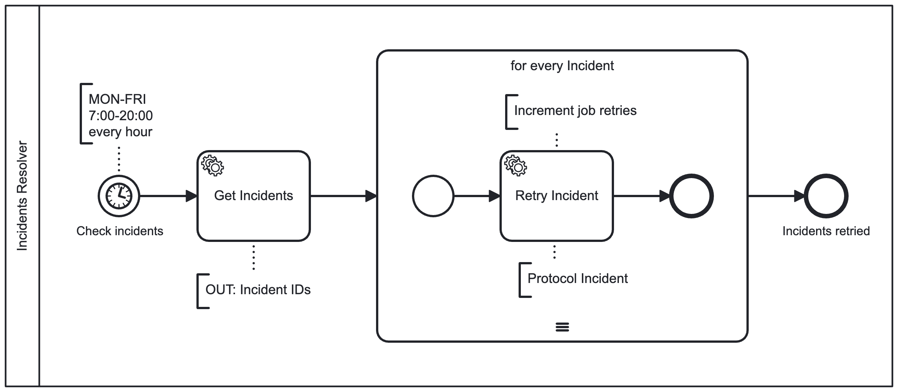
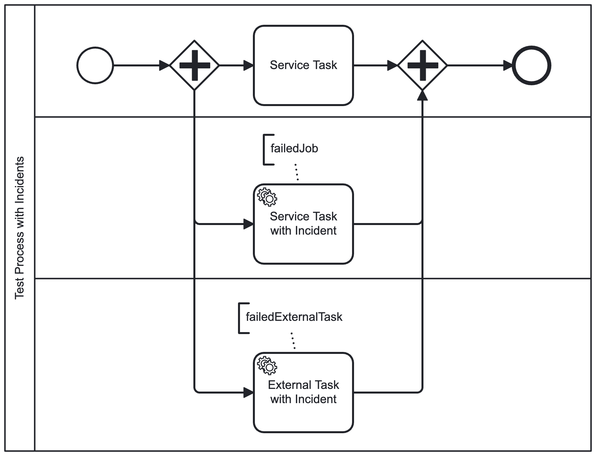
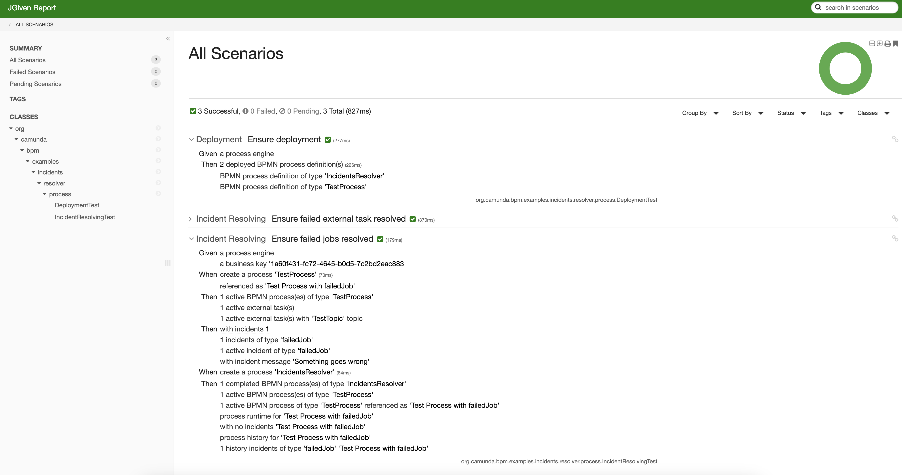

# Incidents Resolver

Technical BPMN process to resolve [Camunda Incidents](https://docs.camunda.org/manual/latest/user-guide/process-engine/incidents/).

Why?
* the external system could be not available (downtime) and after 3 retries there is an Incident
* you don't want (or have time) to retry Incidents manually
* this is just another Admin in your Team :-)

BPMN Process:


Test Process with Incidents:


## Test Reports

### Deployment Test:
```
Test Class: org.camunda.bpm.examples.incidents.resolver.process.DeploymentTest

 Ensure deployment

   Given a process engine
    Then 2 deployed BPMN process definition(s)
         BPMN process definition of type 'IncidentsResolver'
         BPMN process definition of type 'TestProcess'
```

### Process Test:
```
Test Class: org.camunda.bpm.examples.incidents.resolver.process.IncidentResolvingTest

 Ensure failed jobs resolved

   Given a process engine
         a business key 'fde4db76-3a9e-49ed-9639-09d09ced848d'
    When create a process 'TestProcess'
         referenced as 'Test Process with failedJob'
    Then 1 active BPMN process(es) of type 'TestProcess'
         1 active external task(s)
         1 active external task(s) with 'TestTopic' topic
    Then with incidents 1 [in runtime]
         1 incidents of type 'failedJob'
         1 active incident of type 'failedJob'
         with incident message 'Something goes wrong'
    When create a process 'IncidentsResolver'
    Then 1 completed BPMN process(es) of type 'IncidentsResolver'
         1 active BPMN process(es) of type 'TestProcess'
         1 active BPMN process of type 'TestProcess' referenced as 'Test Process with failedJob'
         process runtime for 'Test Process with failedJob'
         with no incidents 'Test Process with failedJob'
         process history for 'Test Process with failedJob'
         1 history incidents of type 'failedJob' 'Test Process with failedJob'

 Ensure failed external task resolved

   Given a process engine
         a business key '13198e78-6f78-4527-ae61-de18b1d8b131'
    When create a process 'TestProcess'
         referenced as 'Test Process with failedJob'
    Then 1 active BPMN process(es) of type 'TestProcess'
         1 active external task(s)
         1 active external task(s) with 'TestTopic' topic
         with no incidents
    When complete all active external tasks for 'TestTopic' topic with error 'TestTopic Error'
    Then with incidents 1 [in runtime]
         1 incidents of type 'failedExternalTask'
         1 active incident of type 'failedExternalTask'
         with incident message 'TestTopic Error'
         1 active external task with 'TestTopic' topic [external task]
         with external task retries '0'
         with external task error message 'TestTopic Error'
    When create a process 'IncidentsResolver'
    Then 1 completed BPMN process(es) of type 'IncidentsResolver'
         1 active BPMN process(es) of type 'TestProcess'
         1 active BPMN process of type 'TestProcess' referenced as 'Test Process with failedJob'
         process runtime for 'Test Process with failedJob'
         with no incidents 'Test Process with failedJob'
         process history for 'Test Process with failedJob'
         1 history incidents of type 'failedExternalTask' 'Test Process with failedJob'
         1 active external task with 'TestTopic' topic [task is still active, needs to be processed by external client]
         with external task retries '1' [externalTaskService.setRetries +1]
         with external task error message 'TestTopic Error'
```

