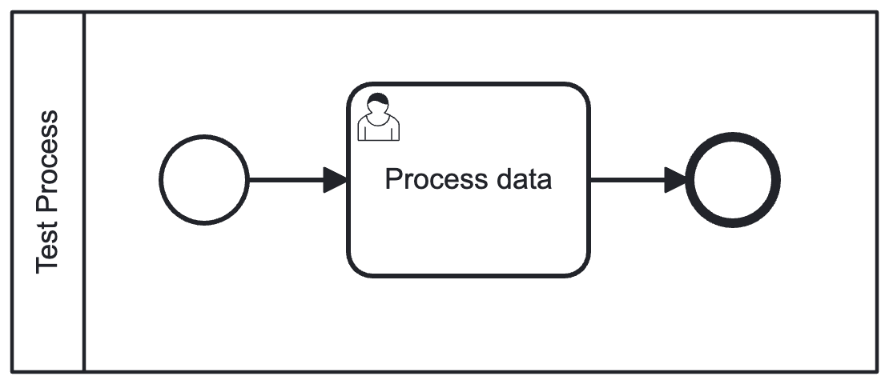
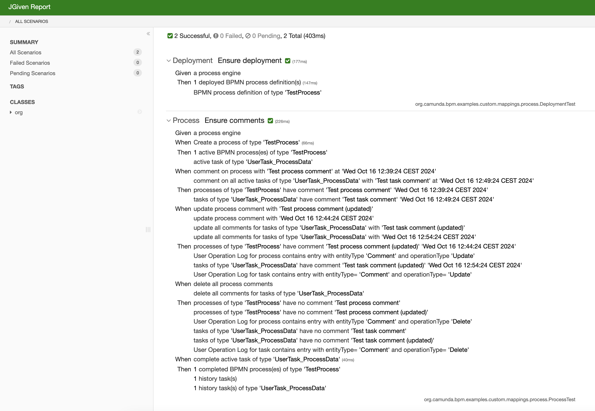

# MyBatis Custom Mappings
Camunda extension for Process/Task comments.

## Why
* By default, you can only `create` comments for processes and tasks, not ~~update~~ or ~~delete~~. 
* Also, while creating a comment, Camunda uses `currentTime()` to store it - there is no way to define ~~custom timestamp~~. This could be the issue if you want to migrate your processes with original timestamps.

## Features
* `addComment` with custom timestamp
* `selectCommentById`
* `updateCommentById`: can change userId, message, timestamp
* `deleteCommentById`

## How
* Define your own `CustomProcessEnginePlugin` and extend myBatis mappings:
```java
@Slf4j
@Component
public class CustomProcessEnginePlugin extends AbstractProcessEnginePlugin {

  public static final List<String> customMappings = List.of(
      "mapping/Comment.xml"
  );

  @Override
  public void postInit(ProcessEngineConfigurationImpl processEngineConfiguration) {
    // -- Custom mappings
    addCustomMappings(processEngineConfiguration.getDbSqlSessionFactory().getSqlSessionFactory().getConfiguration());
  }

  private void addCustomMappings(Configuration configuration) {
    customMappings.forEach(resourceName -> {
      log.info("loading {}", resourceName);
      var inputStream = ReflectUtil.getResourceAsStream(resourceName);
      var mapperParser = new XMLMapperBuilder(inputStream, configuration, resourceName,
          configuration.getSqlFragments());
      mapperParser.parse();
    });
  }

}
```
* Implement the Commands as:
  * extension to Camunda commands (`AddComment`) 
  * or completely new (`SelectComment`, `UpdateComment`, `DeleteComment`)

See the implementation for commands [here](src/main/java/org/camunda/bpm/examples/custom/mappings/engine/cmd).

## Test Process


## Test Reports

### Deployment Test:
```
Test Class: org.camunda.bpm.examples.custom.mappings.process.DeploymentTest

 Ensure deployment

   Given a process engine
    Then 1 deployed BPMN process definition(s)
         BPMN process definition of type 'TestProcess'
```

### Process Test:
```
Test Class: org.camunda.bpm.examples.custom.mappings.process.ProcessTest

 Ensure comments

   Given a process engine
    When Create a process of type 'TestProcess'
    Then 1 active BPMN process(es) of type 'TestProcess'
         active task of type 'UserTask_ProcessData'
    When comment on process with 'Test process comment' at 'Wed Oct 16 13:15:01 CEST 2024'
         comment on all active tasks of type 'UserTask_ProcessData' with 'Test task comment' at 'Wed Oct 16 13:25:01 CEST 2024'
    Then processes of type 'TestProcess' have comment 'Test process comment' 'Wed Oct 16 13:15:01 CEST 2024'
         tasks of type 'UserTask_ProcessData' have comment 'Test task comment' 'Wed Oct 16 13:25:01 CEST 2024'
    When update process comment with 'Test process comment (updated)'
         update process comment with 'Wed Oct 16 13:20:01 CEST 2024'
         update all comments for tasks of type 'UserTask_ProcessData' with 'Test task comment (updated)'
         update all comments for tasks of type 'UserTask_ProcessData' with 'Wed Oct 16 13:30:01 CEST 2024'
    Then processes of type 'TestProcess' have comment 'Test process comment (updated)' 'Wed Oct 16 13:20:01 CEST 2024'
         User Operation Log for process contains entry with entityType 'Comment' and operationType 'Update'
         tasks of type 'UserTask_ProcessData' have comment 'Test task comment (updated)' 'Wed Oct 16 13:30:01 CEST 2024'
         User Operation Log for task contains entry with entityType= 'Comment' and operationType= 'Update'
    When delete all process comments
         delete all comments for tasks of type 'UserTask_ProcessData'
    Then processes of type 'TestProcess' have no comment 'Test process comment'
         processes of type 'TestProcess' have no comment 'Test process comment (updated)'
         User Operation Log for process contains entry with entityType 'Comment' and operationType 'Delete'
         tasks of type 'UserTask_ProcessData' have no comment 'Test task comment'
         tasks of type 'UserTask_ProcessData' have no comment 'Test task comment (updated)'
         User Operation Log for task contains entry with entityType= 'Comment' and operationType= 'Delete'
    When complete active task of type 'UserTask_ProcessData'
    Then 1 completed BPMN process(es) of type 'TestProcess'
         1 history task(s)
         1 history task(s) of type 'UserTask_ProcessData'
```

