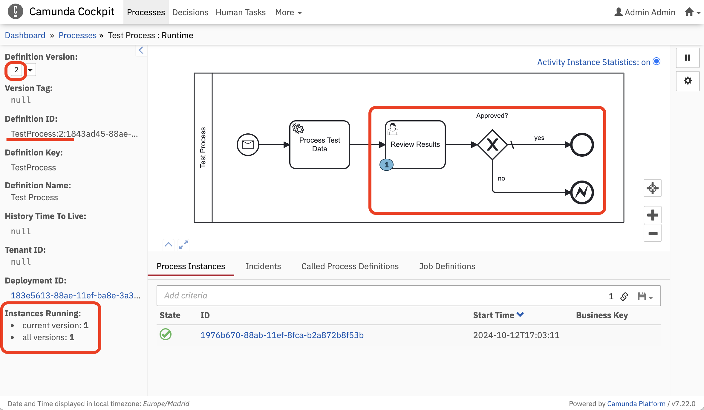

# Process Instance Migration

Camunda extension to schedule [Process Instance Migration](https://docs.camunda.org/manual/latest/user-guide/process-engine/process-instance-migration/) batch on application start.

## Why
* there is no way to migrate process instances in Community Edition version from Cockpit, this feature is only available for [Enterprise Version](https://docs.camunda.org/manual/latest/webapps/cockpit/bpmn/process-instance-migration/).
* even having Enterprise Version, most of the process definition changes could be processed by Default Migration - so it could be automated.

## Features
* migrates process instances from Version `A` to Version `B` (`previous` to `actual`) for every process definition
* uses a <mark>Default</mark> Migration Plan

## BPMN Test Process
Version 1: 
Version 2: 

## How to test it
1. Start the Spring Boot App, it uses H2-database in file.
2. Go to [Camunda Cockpit](http://localhost:8080) and create a process so we have a running instance in <mark>Version 1</mark>.

3. Stop the application and extend the BPMN process by adding some more activities (or use the one I have prepared [here](src/main/resources/bpmn/Test.bpmn.v2)).
4. Start the application again, you should see in the logs something like this:
```
Scheduled a batch '1857aa79-88ae-11ef-ba8e-3a3e9ef344cd' to migrate '1' process instances of 'TestProcess:1:c684debd-8812-11ef-8fca-b2a872b8f53b' to 'TestProcess:2:1843ad45-88ae-11ef-ba8e-3a3e9ef344cd'
```
5. Go to [Camunda Cockpit](http://localhost:8080) and make sure the process has been migrated to <mark>Version 2</mark>.

