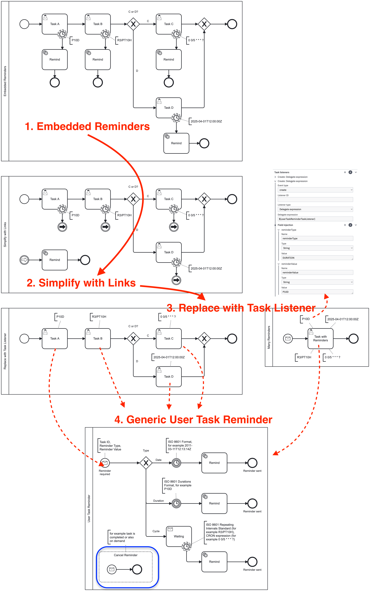
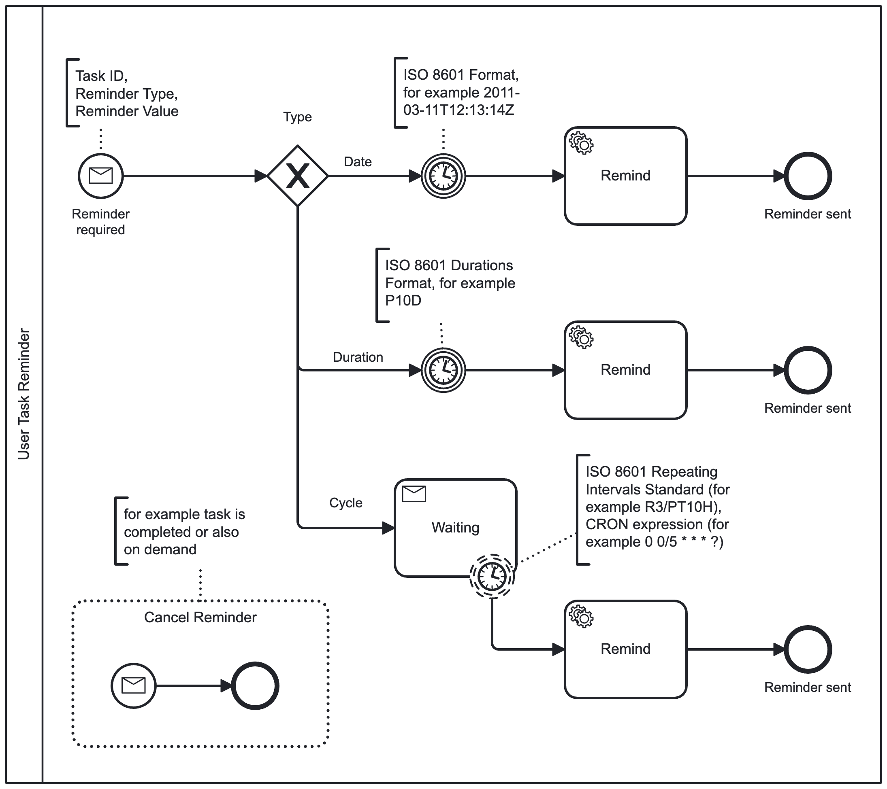
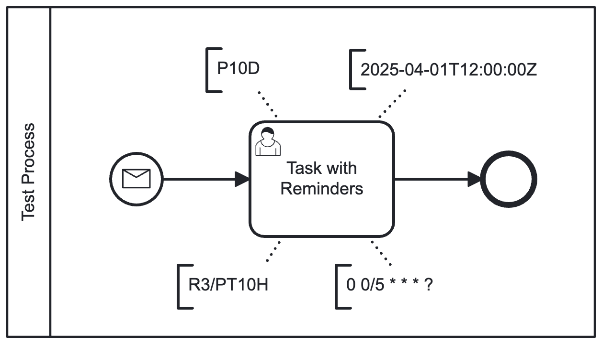
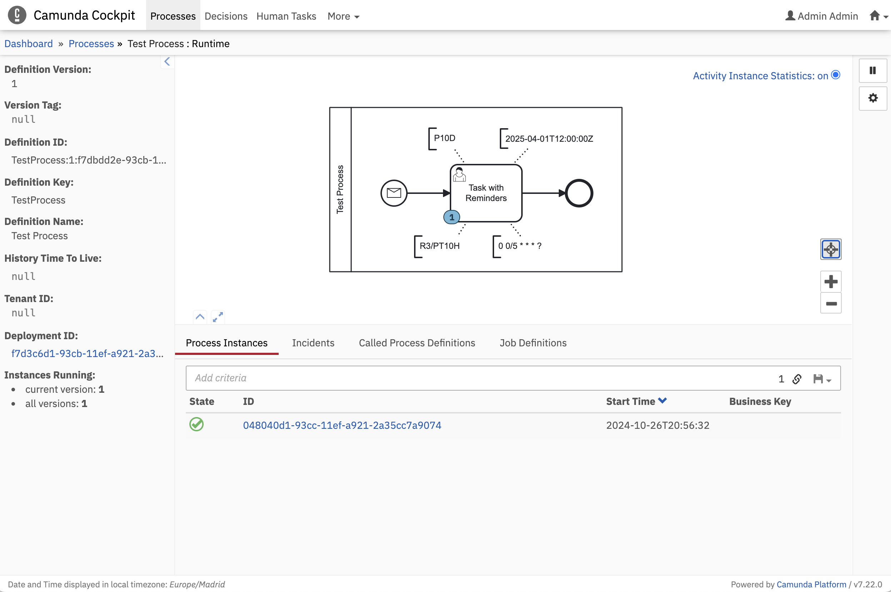
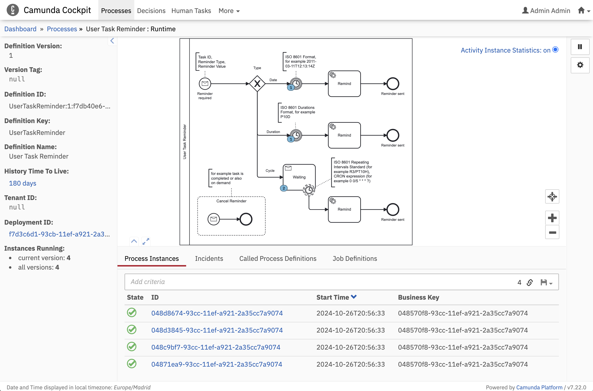
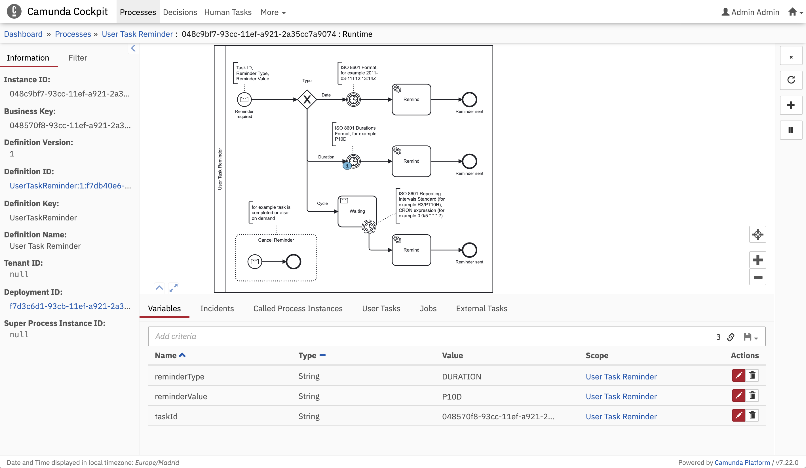

# User Task Reminder

BPMN Process implementing generic 'User Task Reminder' functionality and 'Task Listener' to configure reminder for any specific task.

## Why
* The idea is to replace <mark>non-interrupting</mark> boundary [timer event(s)](https://docs.camunda.org/manual/latest/reference/bpmn20/events/timer-events/) with one or many Task listeners starting BPMN process.
* Sometimes it makes sense to implement generic reminder functionality and not overload BPMN diagram with boilerplate code.



## Features
* Generic `User Task Reminder` BPMN process

  * supports DATE, DURATION and CYCLE types
  * When task is completed, all reminders are terminated (see [extension](src/main/java/org/camunda/bpm/examples/usertask/reminder/engine/CustomHistoryLevelFull.java) in global history event listener)
    ```java
      @Override
      public boolean isHistoryEventProduced(HistoryEventType eventType, Object entity) {
        if (TASK_INSTANCE_COMPLETE.equals(eventType) && entity instanceof TaskEntity task) {
          taskEntityCompleted(task);
        }
        return super.isHistoryEventProduced(eventType, entity);
      }
    
      private void taskEntityCompleted(TaskEntity task) {
        runtimeService().createMessageCorrelation(MESSAGE_CANCEL_TASK_REMINDER)
            .processInstanceVariablesEqual(Map.of(PARAM_TASK_ID, task.getId()))
            .correlateAll();
      }
    ```
* Task Listener `userTaskReminderTaskListener`, see examples how to activate in BPMN
```xml
<bpmn:userTask id="UserTask_Reminders" name="Task with Reminders" camunda:asyncBefore="true">
  <bpmn:extensionElements>
    <camunda:taskListener delegateExpression="${userTaskReminderTaskListener}" event="create">
      <camunda:field name="reminderType">
        <camunda:string>DATE</camunda:string>
      </camunda:field>
      <camunda:field name="reminderValue">
        <camunda:string>2025-04-01T12:00:00Z</camunda:string>
      </camunda:field>
    </camunda:taskListener>
    <camunda:taskListener delegateExpression="${userTaskReminderTaskListener}" event="create">
      <camunda:field name="reminderType">
        <camunda:string>DURATION</camunda:string>
      </camunda:field>
      <camunda:field name="reminderValue">
        <camunda:string>P10D</camunda:string>
      </camunda:field>
    </camunda:taskListener>
    <camunda:taskListener delegateExpression="${userTaskReminderTaskListener}" event="create">
      <camunda:field name="reminderType">
        <camunda:string>CYCLE</camunda:string>
      </camunda:field>
      <camunda:field name="reminderValue">
        <camunda:string>R3/PT10H</camunda:string>
      </camunda:field>
    </camunda:taskListener>
    <camunda:taskListener delegateExpression="${userTaskReminderTaskListener}" event="create">
      <camunda:field name="reminderType">
        <camunda:string>CYCLE</camunda:string>
      </camunda:field>
      <camunda:field name="reminderValue">
        <camunda:string>0 0/5 * * * ?</camunda:string>
      </camunda:field>
    </camunda:taskListener>
  </bpmn:extensionElements>
  ...
</bpmn:userTask>
```

## Test process


* start it with no variables from Cockpit

* we have 4 reminders associated with User Task (= business key)

* for example



